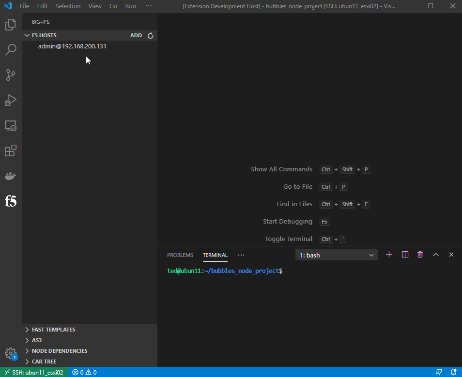
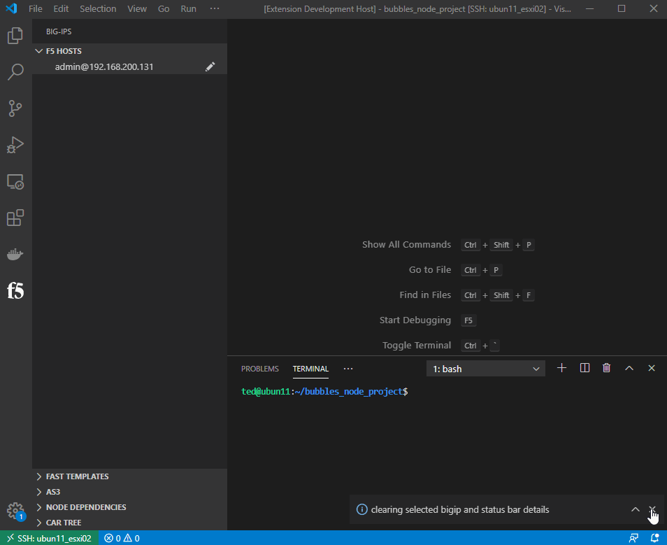
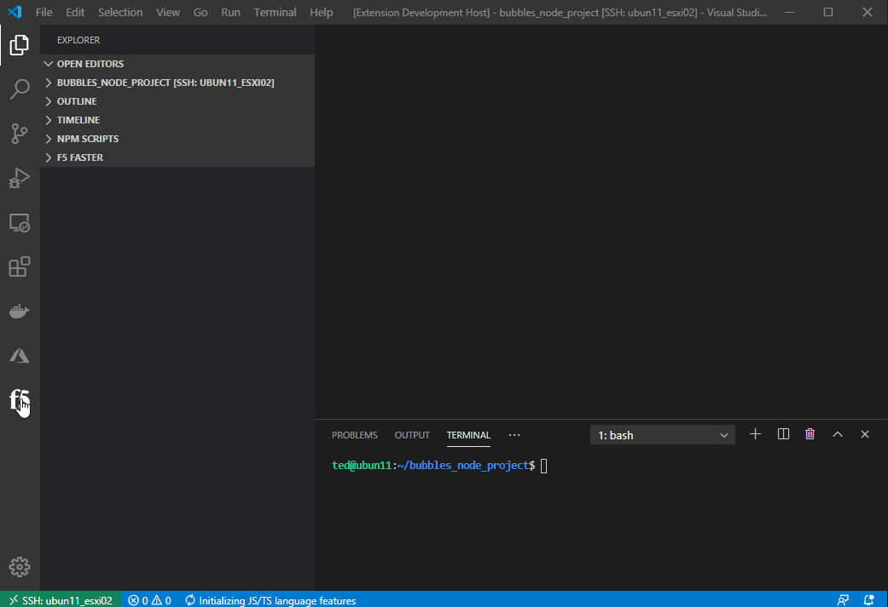

# vscode-f5-fast README

This is the README for the F5 Automation Services Templates(FAST), "vscode-f5-fast". 

This extension is intented to help interface with the FAST servoce to manage templates and deploy applications.

## Demo of early stages..

### Demo showing device mgmt (add, modify, delete, connect, show F5 host info)


### Demo showing connect to device, load sample AS3 from local, post AS3 to connected F5, see response






---

## Index

* [CHANGELOG](CHANGELOG.md)
* [VS Code Exension Dev Quickstart](./README_docs/vsc-extension-quickstart.md)
* [Project Ideas](./README_docs/project_details.md)
* [Extension Interface](./README_docs/extensionInterface.md)
* [Detailed work flow ideas](./README_docs/workflows.md)
* [Research](./README_docs/research.md)

---

## Features and workflows

* Connect to FAST service/engine (via API)
  * Manage multiple FAST services
    * select which one to work with
  * Authenticate
    * Basic Auth
    * Token Auth
  * List templates
  * Modify template
  * Upload template
  * Clone template?
  * Create template
  * Deploy template
* Highlight suggested variable placement
  * take a raw as3 declaration with no variables, just unique names like posting directly to as3, with a hot-key-combo, highlight all the typical areas that would need to be replaced with variables to make the declaration a template
* Intelligent posting:
  * utilize async functions
  * key off 202 of original post till job completes
  * Settings like job check delay 3 or 5 seconds
* Autocomplete
  * Provide suggestions for autocomplete of words
* CodeSnippets
  * Provide code snippets to complete parts of the declaration
  * start typing a class object name, it can provide the remaining brackets/commas to comlete the object, including required class definition
  * Once class definition is complete provide options for snippits/autocomplete of options only available to that class
* Provide easy links to public github repos, schemas, and documentation

---

## History

Details about VS Code, what it is, how it compares to other tools and popularity:

* [WikiPedia: Visual Studio Code](https://en.wikipedia.org/wiki/Visual_Studio_Code)
* [What is the difference between an IDE and an editor?](https://discuss.atom.io/t/what-is-the-difference-between-an-ide-and-an-editor/32629)
* [StackOverFlow: Developer Survey Results](https://insights.stackoverflow.com/survey/2019#development-environments-and-tools)

---

## Requirements

Currently utilizing built in node modules, no external dependencies yet...

### Imports:

* http/https

### Future dependency predictions:
* some sort of json/yaml linter(intellisense) (what is the difference?)
* json parser?
* authentication
  * basic
  * auth token
* timestamp/uuid generator
* CodeLens to provide inline links to do things like post highlighted json...[https://github.com/microsoft/vscode-extension-samples/tree/master/codelens-sample]

---

## Extension Settings

******** **NONE at this time** *********

Include if your extension adds any VS Code settings through the `contributes.configuration` extension point.

For example:

This extension contributes the following settings:

* `myExtension.enable`: enable/disable this extension
* `myExtension.thing`: set to `blah` to do something

## Known Issues

Calling out known issues can help limit users opening duplicate issues against your extension.

## Release Notes

Users appreciate release notes as you update your extension.

### 1.0.0

Initial release of this amazing extension!!!

### 1.0.1

Fixed issue #.

### 1.1.0

Added features X, Y, and Z.

---

### For more information

* [Visual Studio Code's Markdown Support](http://code.visualstudio.com/docs/languages/markdown)
* [Markdown Syntax Reference](https://help.github.com/articles/markdown-basics/)

**Enjoy!**


## Running the extension for dev

- Clone and install dependencies:
    ```bash
    git clone https://github.com/DumpySquare/vscode-f5-fast.git
    cd cd vscode-f5-fast/
    npm install
    code .
    ```
- Start Debugging environment: Keystroke `F5`
- Navigate to view container by clicking on the f5 icon in the Activity bar (typically on the left)
- Update device list in tree view on the left with a device in your environment
  - ***ADD*** in the ***F5 Hosts*** view
  - or `click` the pencil icon on an item and modify the item
- Connect to device
  - (`click` device in host tree or `Cntrl+shift+P` or `F1`)
